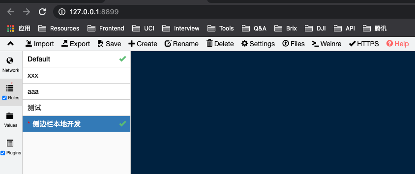
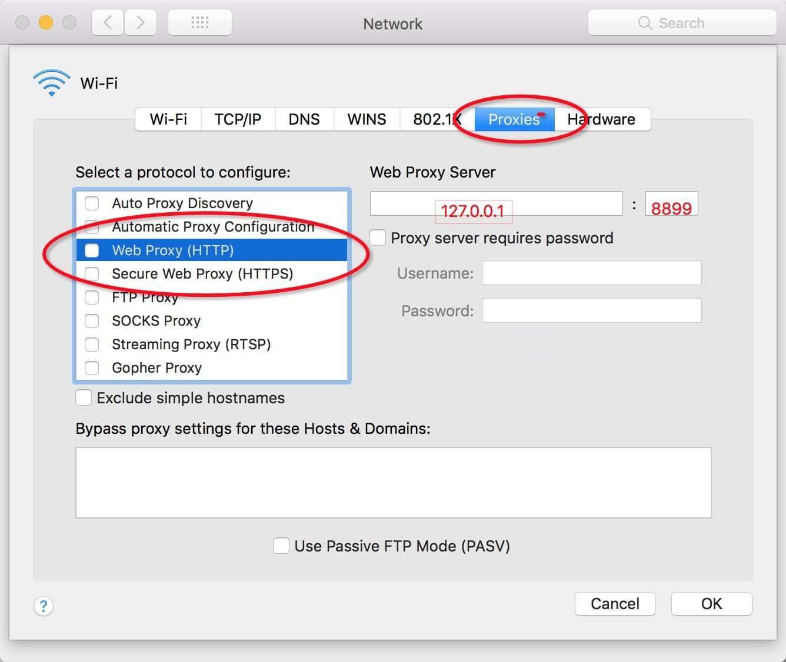

# 本地开发

刚刚已经把项目启动了，前端在 3000 端口，后端在 5000 端口。

侧边栏开发最难的莫过于配置本地开发环境了，下面就聊聊怎么搭建本地开发环境。

## 怎么把侧边栏映射到本地

《配置侧边栏H5》这一步给侧边栏配置了 [https://www.baidu.com](https://www.baidu.com)。
假设这个就是我们要用的域名，怎么把侧边栏映射到本地呢？

翻了很多网上的资料，基本都是改 hosts 文件来让 https://www.baidu.com 打到 localhost:3000 的。
怎么说呢，感觉上就很不"本地"，因为会有一个"哎呀，我改了本地 hosts 文件，等开发完了要再改回去"的心理负担，不是很灵活。

我们只想做个代理、或者转发呀。

## Whistle 简介

这里就不得不安利一波我们 IMWeb 出品的 Whistle 啦，whistle(读音[ˈwɪsəl]，拼音[wēisǒu])，是基于Node实现的跨平台web调试代理工具。

Whistle 功能有非常的多，下面我只列举开发侧边栏常用的配置项，更多好玩的可以见 [Whistle 官网](https://wproxy.org/whistle/)。

现在我们的目标是把企业微信的 baidu.com 通过 whistle 代理，在 whistle 上设置代理规则，把 baidu.com 代理到本地 localhost 即可。

## 本机全局代理

首先先安装 Whistle

```shell
# 安装
npm install -g whistle

# 开启 Whistle
w2 start
```

打开 [http://127.0.0.1:8899/](http://127.0.0.1:8899/) 可见 Whistle 代理面板。



下面要把本机的请求都用 Whistle 来做代理：

System Preferences > Network > Advanced > Proxies > HTTP or HTTPS




这里最好 Web Proxy(HTTP) 和 Secure WebProxy(HTTPS) 都用 127.0.0.1:8899 做代理。

到了这一步，

## 添加规则

加入规则：

```
# 把 baidu.com 映射到本地 3000 端口
//www.baidu.com http://127.0.0.1:3000
```


重启企业微信（会有缓存），打开侧边栏。


恭喜你！已经成功搭建好了本地环境了👏
